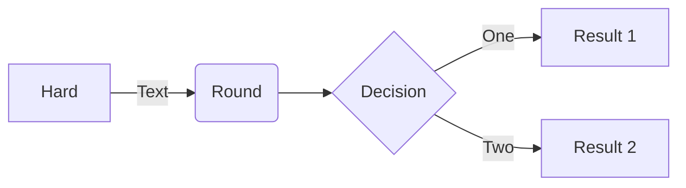

- [src](#src)
  - [assets](#assets) : 存放静态文件，例如logo、图片等
  - [router](#router)
    - [index.js](#index.js) : Vue使用VueRouter，定义router，初始化VueRouter，beforeEach拦截并动态绑定路由
  - [store](#store)
    - [modules](#modules)
      - [menus.js](#menus.js) : index.js的扩展，初始化menuList、permList、hasRoutes、editableTabsValue、editableTabs，添加setMenuList、setPermList、changeRouteStatus、addTab、resetState方法
    - [index.js](#index.js) : Vue使用Vuex，初始化token，添加SET_TOKEN方法，引用menus模块
  - [views](#views) : 业务页面
  - [App.vue](#App.vue) : 添加<router-view/>到id="app"中，监听$route调用addTab方法
  - [axios.js](#axios.js) 
  - [globalFun.js](#globalFun.js) : 使用mixin添加hasAuth方法，判断是否有访问权限
  - [main.js](#main.js) : 引入./axios，禁用vue提示，引入Element，初始化vue挂载于#app
  - [mock.js](#mock.js) : 初始化Result，拦截各个请求返回mock数据

